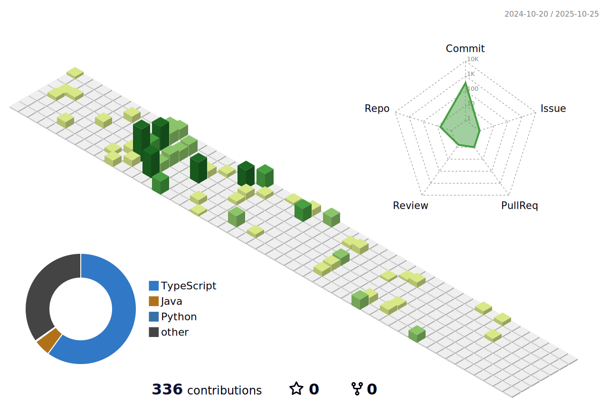

  

## Hi, 👋 I'm Mozzie

- 📫 联系方式: du.mozzie@outlook.com

### My GitHub Contributions

<picture>
  <source media="(prefers-color-scheme: dark)" srcset="https://raw.githubusercontent.com/du-mozzie/du-mozzie/output/github-contribution-grid-snake-dark.svg">
  <source media="(prefers-color-scheme: light)" srcset="https://raw.githubusercontent.com/du-mozzie/du-mozzie/output/github-contribution-grid-snake.svg">
  
</picture>

### My GitHub Stats

   
  

<!--END_SECTION:waka-->

### My GitHub Contributions

